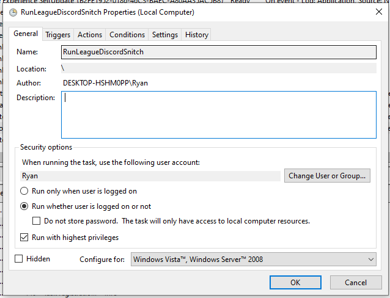
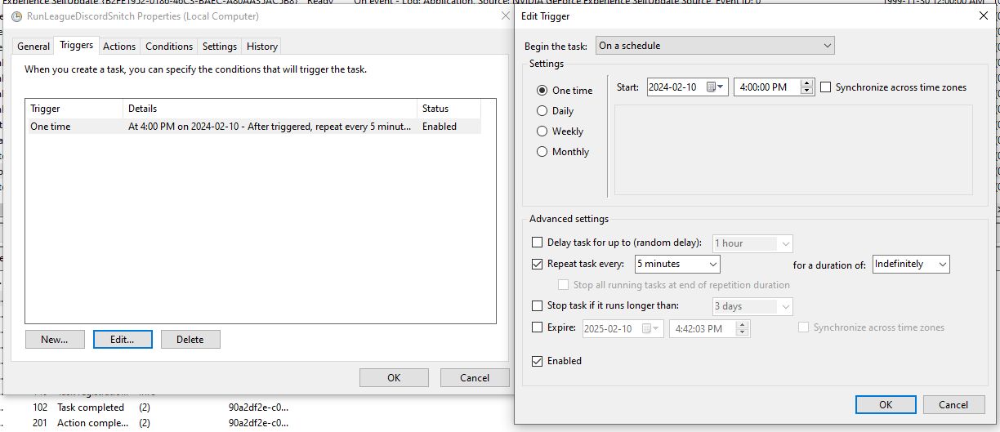
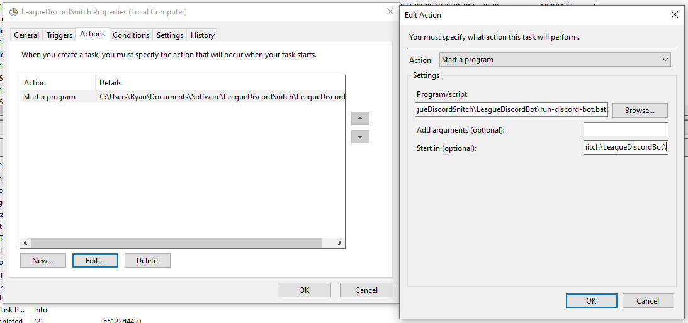
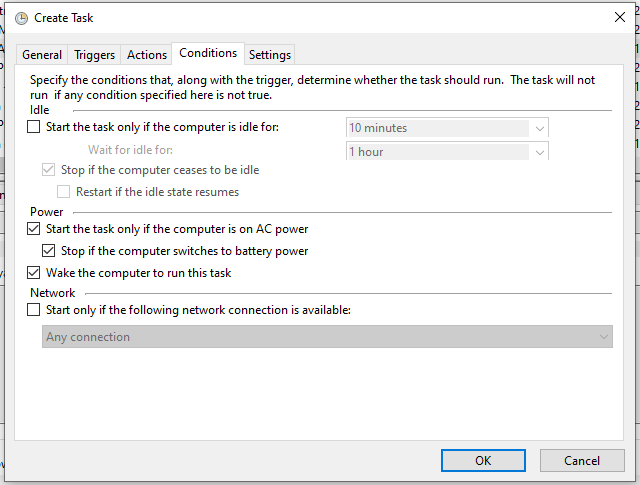
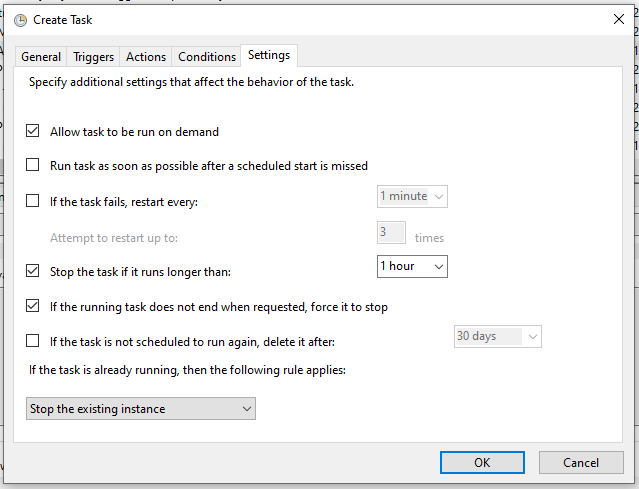

# LeagueDiscordBot

aka The League Snitch

This discord bot checks to see if players are streaming their League of Legends gameplay, if they are not... then they will be ROASTED!

## File Structure Setup

We use [LeagueDiscordBotFiles](https://github.com/rlubin/LeagueDiscordBotFiles) repository to store environment variables, custom roasts, and account associations.

    ── LeagueDiscordSnitch
     ├── LeagueDiscordBot
     ├── LeagueDiscordBotFiles

## Setup Windows Task Scheduler

## Batch File Refactor

Edit all the locations in run-discord-bot.bat to the absolute paths on your pc.

## Future Features To Look Out For

<ul>
<li>League leaderboard (slash command)</li>
<li>thank you message if user starts streaming before next check</li>
<li>add basic unit testing</li>
<li>possibly start using github secrets</li>
<li>need more custom roasts</li>
<li>handling of edge cases in LeageuSnitch.js</li>
<li>convert to typescript?</li>
<li>create a riot api class and add throttling</li>
</ul>

## Authors (alphabetical)

<ul>
<li>Ryan Lubin</li>
<li>Gavin Tai</li>
</ul>
